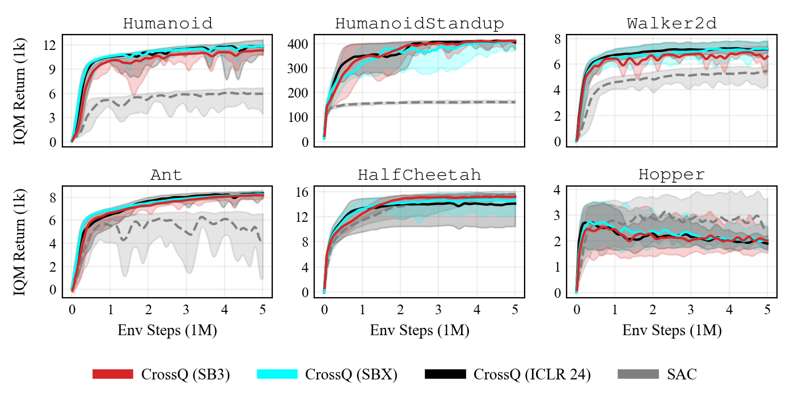

.. _crossq:

.. automodule:: sb3_contrib.crossq

CrossQ
======

Implementation of CrossQ proposed in:

`Bhatt A.* & Palenicek D.* et al. Batch Normalization in Deep Reinforcement Learning for Greater Sample Efficiency and Simplicity. ICLR 2024.`

CrossQ is an algorithm that uses batch normalization to improve the sample efficiency of off-policy deep reinforcement learning algorithms.
It is based on the idea of carefully introducing batch normalization layers in the critic network and dropping target networks.
This results in a simpler and more sample-efficient algorithm without requiring high update-to-data ratios.

.. rubric:: Available Policies

.. autosummary::
    :nosignatures:

    MlpPolicy

.. note::

  Compared to the original implementation, the default network architecture for the q-value function is ``[1024, 1024]``
  instead of ``[2048, 2048]`` as it provides a good compromise between speed and performance.

.. note::

  There is currently no ``CnnPolicy`` for using CrossQ with images. We welcome help from contributors to add this feature.

Notes
-----

- Original paper: https://openreview.net/pdf?id=PczQtTsTIX
- Original Implementation: https://github.com/adityab/CrossQ
- SBX (SB3 Jax) Implementation: https://github.com/araffin/sbx

Can I use?
----------

-  Recurrent policies: ❌
-  Multi processing: ✔️
-  Gym spaces:

============= ====== ===========
Space         Action Observation
============= ====== ===========
Discrete      ❌      ✔️
Box           ✔️      ✔️
MultiDiscrete ❌      ✔️
MultiBinary   ❌      ✔️
Dict          ❌      ❌
============= ====== ===========

Example
-------

.. code-block:: python

  from sb3_contrib import CrossQ

  model = CrossQ("MlpPolicy", "Walker2d-v4")
  model.learn(total_timesteps=1_000_000)
  model.save("crossq_walker")

Results
-------

Performance evaluation of CrossQ on six MuJoCo environments, see `PR #243 <https://github.com/Stable-Baselines-Team/stable-baselines3-contrib/pull/243>`_.
Compared to results from the original paper as well as a version from `SBX <https://github.com/araffin/sbx>`_.

Open RL benchmark report: https://wandb.ai/openrlbenchmark/sb3-contrib/reports/SB3-Contrib-CrossQ--Vmlldzo4NTE2MTEx

How to replicate the results?
^^^^^^^^^^^^^^^^^^^^^^^^^^^^^

Clone RL-Zoo:

.. code-block:: bash

  git clone https://github.com/DLR-RM/rl-baselines3-zoo
  cd rl-baselines3-zoo/

Run the benchmark (replace ``$ENV_ID`` by the envs mentioned above):

.. code-block:: bash

  python train.py --algo crossq --env $ENV_ID --n-eval-envs 5 --eval-episodes 20 --eval-freq 25000

Plot the results:

.. code-block:: bash

  python scripts/all_plots.py -a crossq -e HalfCheetah Ant Hopper Walker2D -f logs/ -o logs/crossq_results
  python scripts/plot_from_file.py -i logs/crossq_results.pkl -latex -l CrossQ

Comments
--------

This implementation is based on SB3 SAC implementation.

Parameters
----------

.. autoclass:: CrossQ
  :members:
  :inherited-members:

.. _crossq_policies:

CrossQ Policies
---------------

.. autoclass:: MlpPolicy
  :members:
  :inherited-members:

.. autoclass:: sb3_contrib.crossq.policies.CrossQPolicy
  :members:
  :noindex:
